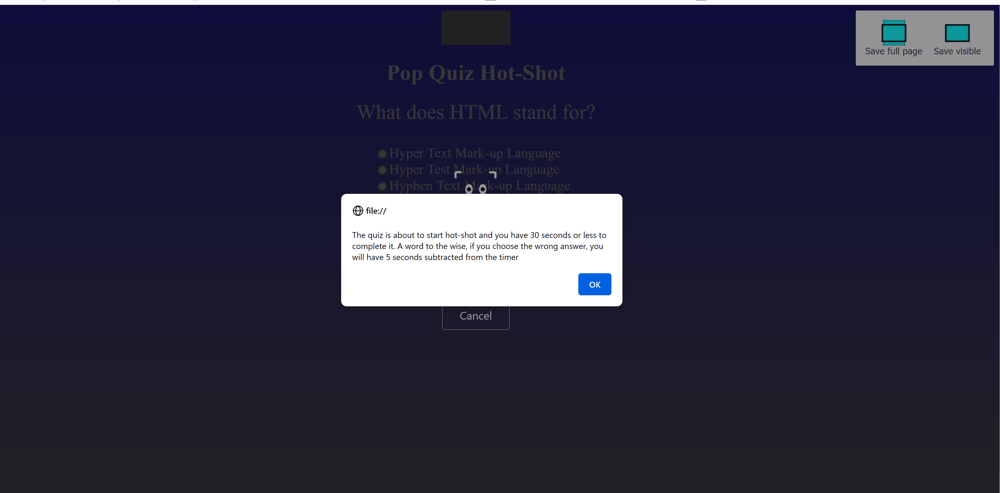
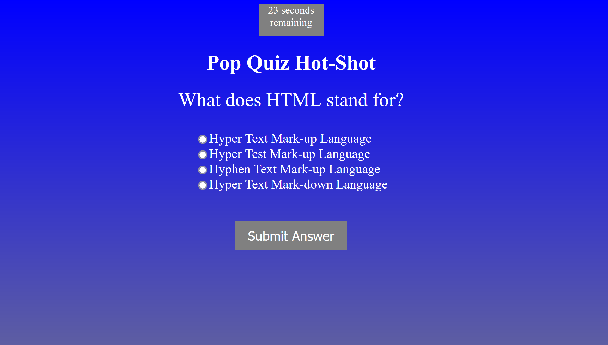

# Pop-Quiz

## Summary
 Hello Strangers! My name is Marko Majetic and I have created a quiz testing your knowledge on web development using Javascript, HTML and CSS. This timed quiz contains four questions and each question has four answers to choose from.Once the quiz is completed, you will enter your initials and your information will be
stored locally and your initials, along with your score, will displayed.If you wish to try the quiz again, there is a play again button that will reset the quiz
to the beginning.

## Usage

 - To run the application, click on the link near the bottom of the README.md file
 - You will be directed to the web-page where the pop quiz is located and
   you see a window screen pop up that contains an alert that informs youchow much
   time you are given and the time penalty for answering a question incorrectly
 - You will answer a series of questions on web development and when you submit an
   answer, you will see if you answered it correctly, or, incorrectly
 - When the quiz is finished, either by submitting all four questions early, or,the
   time expiring, you will see an input with a submit initial button below it
 - You'll enter your initials, click on the sibmit intials button and your name and
   score will be displayed
 - The replay quiz button will appear and you will have the option of starting the
     quiz all over again
       
    
## Screenshot

## Installation
   N/A

## Credits
   N/A

## Website Link

https://fringemonkey89.github.io/pop-quiz/

## License
 MIT License

